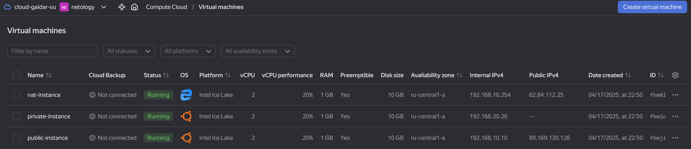
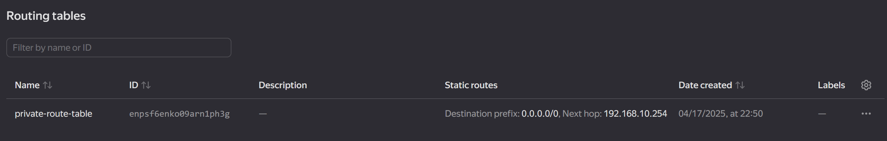

# Домашнее задание к занятию «Организация сети»

### Задание 1. Yandex Cloud 

Развернул виртуалки в соответствии с заданием

А так-же сеть и подсети (видно, что к private зацеплена таблица маршрутов)

Таблица маршрутов

Пинг ya.ru с public инстанса

Пинг ya.ru с private инстанса

[Terraform код, которым всё поднимал](.)